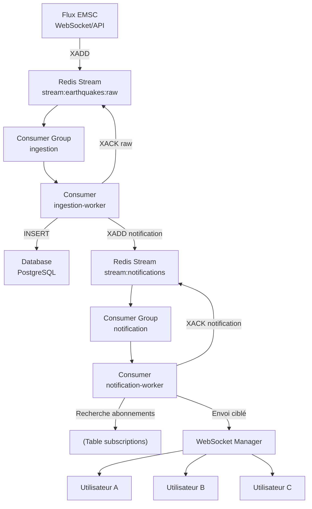
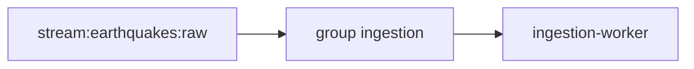

# Pipeline Data Engineering EMSC

Projet d'exploration et de construction d'un pipeline Data Engineering autour des événements sismiques publiés par l'EMSC via l'API FDSN Event de SeismicPortal.

## Objectifs

Le projet suivra progressivement le cycle suivant :

1. explorer les données historiques et temps réel de l'API EMSC ;
2. sélectionner les champs utiles à partir des observations réelles ;
3. appeler, nettoyer et persister les événements ;
4. publier les événements normalisés dans Redis Streams ;
5. permettre aux consommateurs de filtrer les événements avec PostgreSQL et ses politiques RLS ;
6. migrer le déploiement local Podman vers K3S ;
7. ajouter un déploiement GCP après validation du fonctionnement sur K3S.

## Source des données

La source initiale est l'API FDSN Event de SeismicPortal :

```url
https://www.seismicportal.eu/fdsnws/event/1/query
```

Une requête de référence est :

```url
https://www.seismicportal.eu/fdsnws/event/1/query?limit=10&start=2026-09-15T00:00:00.00000&format=json&nodata=204
```

Deux modes d'ingestion sont prévus :

- **historique** : chargement depuis une date configurable, avec possibilité de relancer une période et de reprendre après interruption ;
- **temps réel** : réception des nouveaux événements et des mises à jour via le WebSocket EMSC, avec un polling FDSN configurable comme mécanisme de secours et de réconciliation.

La déduplication et la gestion des événements mis à jour seront définies après l'exploration du contenu effectivement renvoyé par l'API.

## Résultats de l'exploration

Une requête portant sur 10 000 événements a permis d'identifier plusieurs propriétés stables ou très fréquentes :

- `type` vaut toujours `Feature` dans l'échantillon observé ;
- `geometry.type` vaut toujours `Point` ;
- `properties.source_catalog` vaut toujours `EMSC-RTS` ;
- `properties.evtype` vaut `ke` dans environ 99 % des cas.

Ces valeurs ne seront pas toutes traitées comme des invariants définitifs :
`source_catalog` peut notamment varier selon le catalogue interrogé et les valeurs minoritaires de `evtype` doivent être conservées pour l'analyse. Les champs `type` et `geometry.type` serviront d'abord à valider la structure du payload. Les champs métier prioritaires sont l'identifiant, le temps, la magnitude, le type de magnitude, la profondeur, la latitude, la longitude, la région, la source et la date de mise à jour.

Les données restent suffisamment compactes pour être explorées avec Jupyter/Pandas, tout en fournissant déjà la matière nécessaire à la conception du pipeline et du futur modèle PostgreSQL/PostGIS.

## Temps réel EMSC par WebSocket

SeismicPortal fournit un service officiel de notification quasi temps réel :

```url
wss://www.seismicportal.eu/standing_order/websocket
```

Un message JSON est envoyé lorsqu'un événement est inséré ou mis à jour. Le message contient une action et les données de l'événement. Cette interface est adaptée à l'ingestion temps réel et évite de dépendre uniquement d'une boucle de requêtes HTTP.

Le client WebSocket devra prévoir :

- reconnexion automatique après une coupure ;
- maintien de la connexion par ping/pong ;
- traitement distinct des actions d'insertion et de mise à jour ;
- déduplication à partir de l'identifiant stable `unid` ou d'un identifiant équivalent validé ;
- validation et persistance avant publication dans Redis Streams ;
- réconciliation périodique avec l'API FDSN pour récupérer les messages éventuellement manqués.

L'API FDSN reste nécessaire pour le chargement historique, la reprise après incident et la réconciliation. Le polling configuré dans le fichier TOML est donc conservé comme mécanisme de secours, et non comme voie principale du temps réel.

## Configuration actuelle

La configuration initiale se trouve dans [`src/config/infra.conf`](src/config/infra.conf) et utilise le format TOML :

```toml
[ingestion]
history_start = "2026-01-01T00:00:00Z"
```

Ces paramètres correspondent aux choix actuels :

- début de l'historique au 1er janvier 2026 ;
- période historique configurable pour permettre des essais sur différentes fenêtres temporelles.

La version finale séparera les paramètres de développement, d'exploitation et les secrets.

> Aucun secret ne doit être enregistré dans le dépôt.

## Exploration Jupyter

La première étape est le notebook
[`notebooks/exploration_emsc.ipynb`](notebooks/exploration_emsc.ipynb).

Il sert à :

- vérifier la structure des réponses JSON ;
- observer les champs présents dans les événements ;
- mesurer les valeurs manquantes et les doublons ;
- examiner les magnitudes, coordonnées et pays disponibles ;
- préparer le futur modèle PostgreSQL/PostGIS sans sélectionner prématurément les colonnes.

Le notebook ne constitue pas encore le pipeline de production. Il doit être exécuté avec un accès réseau à SeismicPortal et les dépendances Python `requests` et `pandas` disponibles dans l'environnement Jupyter.

## Architecture cible

```text
API FDSN Event EMSC ------------------+
        |                             |
        | historique / réconciliation |
        v                             |
WebSocket EMSC ----------------------+
                |
                v
Ingestion temps réel
                |
                v
Validation et normalisation
                |
                +--> PostgreSQL 18 + PostGIS
                |       |
                |       +--> RLS et requêtes des consommateurs
                |
                +--> Redis Streams
                        |
                        +--> présentation
                        +--> abonnements utilisateur
                        +--> service ML futur
```

Le déploiement commencera avec Podman et un compose local. Les services, volumes, variables de configuration et contrôles de santé seront ensuite séparables pour la migration vers K3S.

## Utilisateurs, abonnements et RLS

Une zone d'observation utilisateur correspond à un pays et possède un seuil de magnitude minimal. Les limites d'abonnement sont liées au statut :

| Statut | Nombre maximal de pays |
| --- | ---: |
| `basic` | 5 |
| `pro` | 25 |
| `premium` | illimité |

L'administrateur aura un rôle applicatif et un rôle PostgreSQL. Il pourra consulter l'ensemble des événements. Les consommateurs appliqueront leurs filtres pays et magnitude via PostgreSQL et les politiques RLS, au lieu de faire confiance à un filtrage uniquement côté interface.

## Redis Streams

Le flux principal Redis servira de bus entre l'ingestion et les consommateurs. Il devra permettre la consommation indépendante par groupes, la reprise et la préparation de futurs traitements ML.

Dans un premier temps, l'ingestion publiera un flux normalisé commun et les consommateurs consulteront PostgreSQL/RLS pour appliquer leurs abonnements. Des flux thématiques pourront être ajoutés ensuite, par exemple :

- Méditerranée ;
- Afrique ;
- Antarctique ;
- Déserts.

Ces flux seront des projections spécialisées du flux principal, et non une contrainte imposée au premier pipeline.

## Choix techniques

- Python 3.14 ;
- PostgreSQL 18 avec PostGIS ;
- Redis 8 ;
- Podman au démarrage ;
- Migration en cours vers K3S ;
- Tests ajoutés lorsque des cas métier et des comportements attendus auront été définis.

## Étapes suivantes

- [X] compléter l'exploration EMSC et confirmer les valeurs minoritaires ;
- [X] décider les colonnes normalisées et les données brutes à conserver ;
- [ ] définir les règles de déduplication et de mise à jour ;
- [ ] implémenter le chargement historique FDSN ;
- [ ] implémenter le client WebSocket avec reconnexion et réconciliation ;
- [ ] ajouter PostgreSQL/PostGIS, les migrations et RLS ;
- [ ] brancher Redis Streams et les premiers consommateurs ;
- [ ] préparer Compose Podman, puis les manifests K3S ;
- [ ] étudier le déploiement GCP.

## Vue d'ensemble du streaming Redis



### Etape 1 arrivée d'un évènement EMSC

Le worker EMSC reçoit :

```json
{
    "emsc_id": "12345",
    "country": "FR",
    "magnitude": 4.6
}
```

et l'envoie dans :

```text
stream:earthquakes:raw
```

via :

```python
r.xadd(
    "stream:earthquakes:raw",
    payload
)
```

Le Stream devient :

```text
stream:earthquakes:raw
 
├── 1758890001-0
├── 1758890002-0
└── 1758890003-0
```

### Etape 2 ingestion par le worker

Le groupe :

```text
ingestion
```

lit ce stream.



Le worker :

- valide le JSON ;
- vérifie les doublons ;
- enrichit les données ;
- sauvegarde en base.

### Etape 3 sauvegarde PostgreSQL

```text
earthquake
| id | emsc\_id | country | magnitude |
| -- | -------- | ------- | --------- |
| 42 | 12345    | FR      | 4.6       |
```

Le worker obtient :

```txt
event_id = 42
```
Étape 4 : création d'un événement métier

Au lieu d'envoyer directement vers les sockets, il produit un nouvel événement :

JSON
{
"event_id": 42,
"event_type": "earthquake",
"action": "new",
"country": "FR",
"magnitude": 4.6
}
Afficher plus de lignes

dans :

Plain Text
stream:notifications
Afficher plus de lignes
Python
r.xadd(
"stream:notifications",
payload
)
Afficher plus de lignes
Étape 5 : ACK du message brut

Une fois :

l'écriture PostgreSQL terminée ;
le message de notification créé ;

on valide :

Python
r.xack(
"stream:earthquakes:raw",
"ingestion",
message_id
)
Afficher plus de lignes

Ainsi :

Plain Text
pas de perte de données
Afficher plus de lignes

si le worker plante.

Étape 6 : consommation des notifications
Mermaid
flowchart LR
 
S[stream:notifications]
 
G[group notification]
 
W[notification-worker]
 
S --> G
G --> W
Afficher plus de lignes

Le worker reçoit :

JSON
{
"event_id": 42,
"country": "FR",
"action": "new"
}
Afficher plus de lignes
Étape 7 : recherche des abonnés

PostgreSQL :

SQL
subscriptions
Afficher plus de lignes
user_id	country1	FR
2	FR
3	DE

Le worker exécute :

SQL
SELECT user_id
FROM subscriptions
WHERE country = 'FR'
Afficher plus de lignes

Résultat :

Plain Text
1
2
Afficher plus de lignes
Étape 8 : WebSocket Manager

Le serveur possède :

Python
active_connections = {
1: websocket_1,
2: websocket_2,
3: websocket_3,
}
 
Afficher plus de lignes

Le worker envoie uniquement :

Python
await websocket_1.send_json(...)
await websocket_2.send_json(...)
Afficher plus de lignes

Pas :

Python
websocket_3
Afficher plus de lignes

car l'utilisateur 3 est abonné à l'Allemagne.

Étape 9 : ACK de la notification

Une fois les envois réalisés :

Python
xack(
"stream:notifications",
"notification",
message_id
)
Afficher plus de lignes
Pourquoi j'aime cette architecture

Elle sépare clairement les responsabilités :

Plain Text
stream:earthquakes:raw
↓
collecte des données
 
PostgreSQL
↓
source de vérité
 
stream:notifications
↓
diffusion des événements
 
WebSocket
↓
temps réel utilisateur
Afficher plus de lignes

Et surtout :

Plain Text
EMSC
↓
Redis
↓
PostgreSQL
↓
Redis
↓
WebSocket
Afficher plus de lignes

Chaque étape peut tomber puis redémarrer sans perdre les messages.
