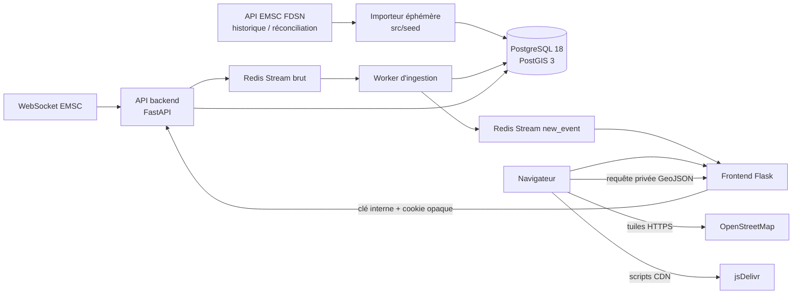

# Registre des choix architecturaux et technologiques

Ce document rassemble les choix structurants faits depuis le lancement du projet et les décisions prises pour la carte historique. Il distingue l’existant, les choix présents dans le code et les évolutions encore différées : un objectif initial n’est pas nécessairement une fonctionnalité disponible.

## 1. Source et finalité des données

- **Domaine :** pipeline d’ingénierie de données sismologiques fondé sur les événements publiés par l’EMSC via SeismicPortal.
- **Source principale :** API FDSN Event pour l’historique et la réconciliation ; WebSocket officiel SeismicPortal pour les insertions et mises à jour temps réel.
- **Données géographiques :** contours Natural Earth pour les pays, continents et zones océaniques. Leur échelle de publication est approximative, en particulier près des côtes.
- **Événements pris en charge par la carte v1 :** séismes uniquement. Les inondations sont prévues dans la configuration des flux, mais leur repository n’est pas encore implémenté et la source n'est pas sélectionnée.

## 2. Architecture applicative

Le projet sépare les responsabilités en services Python spécialisés. Le paquet `src/common` fournit les modèles, connexions et repositories partagés.

- **Backend HTTP :** FastAPI expose les API internes et relaie les événements EMSC temps réel vers Redis.
- **Worker :** consomme les flux Redis, persiste les événements et publie leurs notifications.
- **Frontend :** Flask sert les pages HTML, HTMX et JavaScript. Il relaie vers le backend les appels qui doivent transporter la session ; il ne se connecte pas directement aux bases de données.
- **Flux de notifications existant :** Flask lit `new_event` par WebSocket pour la page de flux en direct. La carte historique n’utilise pas ce WebSocket.
- **Données partagées :** modèles, configuration DB et repositories sont regroupés dans `src/common` afin d’être réutilisés par le worker, l’importeur et les API.

## 3. Langages et bibliothèques

| Domaine | Choix | État et raison |
| --- | --- | --- |
| Services et ingestion | Python 3.14 | Runtime retenu dans les images applicatives. |
| API backend | FastAPI | API HTTP interne et cycle de vie asynchrone du relais EMSC. |
| Interface serveur | Flask, Jinja et HTMX | Pages et formulaires sans imposer une application SPA. |
| Interface interactive | JavaScript navigateur | WebSocket du flux et interactions cartographiques. |
| Styles | SCSS compilé en CSS par Sass | SCSS est la source ; le CSS généré n’est pas édité directement. |
| Carte | Leaflet 1.9.4 | Bibliothèque choisie pour s’intégrer au frontend Flask existant. |
| Regroupement cartographique | Supercluster 8.0.1 | Regroupe les points sur le client et recalcule les groupes après filtrage local. |
| Points superposés | Overlapping Marker Spiderfier Leaflet 0.2.7 | Déploie en éventail les points individuels qui se recouvrent. |
| Chargement des bibliothèques cartographiques | jsDelivr, versions figées et empreintes SRI | Évite une compilation de ces bibliothèques dans les assets locaux ; introduit une dépendance CDN explicitement assumée. |

## 4. Ingestion et cycle de vie des séismes

### Temps réel

1. Le relais FastAPI se connecte au WebSocket EMSC avec ping/pong et reconnexion après coupure.
2. Les messages sont écrits dans le Stream brut `ingest:earthquakes:raw`.
3. Le worker consomme le Stream avec un consumer group Redis, ingère l’événement dans PostgreSQL, publie une notification dans `new_event`, puis acquitte le message brut.
4. Les événements diffusés dans `new_event` reçoivent leurs informations de pays et de continent via PostGIS et `ST_Covers`.

La publication PostgreSQL puis Redis n’est pas une transaction distribuée : une interruption peut causer une notification en double. Une ingestion idempotente et une outbox restent des évolutions possibles. Le Stream de notification n’a pas encore de politique de rétention documentée dans le code.

### Historique

- L’import historique interroge l’API FDSN par journées UTC depuis un conteneur éphémère.
- Les bornes peuvent être configurées au lancement ; l’import s’interrompt si une journée atteint la limite FDSN afin d’éviter un historique tronqué.
- Les contours Natural Earth sont également importés dans la base.
- Les relances d’une période ne sont pas encore idempotentes pour les lignes de détail : elles peuvent ajouter une nouvelle version de détail.

### Versions

- `emsc` représente l’identité stable de l’événement (`ext_id`) et son heure initiale.
- `emsc_details` conserve les versions successives des mesures.
- La carte retient une seule version par événement : le `emsc_details` dont `event_datetime` est le plus récent, puis l’identifiant de détail le plus élevé en cas d’égalité.
- L’appartenance à la période est déterminée par la date initiale de survenue. La version la plus récente peut donc contenir une correction publiée après la période sélectionnée.

## 5. Persistance et migrations

- **Moteur relationnel :** PostgreSQL 18 avec PostGIS 3.
- **Séparation des domaines :** base principale pour les événements et leurs zones ; base utilisateurs distincte pour comptes, OTP et sessions.
- **Modèle spatial :** coordonnées et géométries en SRID 4326 ; l’ordre GeoJSON est longitude, latitude. La position PostGIS d’un détail est générée depuis longitude et latitude.
- **Index spatiaux :** index GiST sur les positions et les limites géographiques.
- **Zones :** `geographic_zone` enregistre les pays, continents et océans ; `ST_Covers` est utilisé pour inclure les points sur la limite d’un polygone.
- **Migrations :** environnements Alembic distincts pour les bases principales et utilisateurs ; les migrations et les rôles de migration sont séparés des rôles d’exécution applicatifs.
- **État du schéma :** les migrations initiales supposent un volume neuf pour ce prototype ; elles ne transforment pas automatiquement un volume historique différent.
- **RLS :** le filtrage PostgreSQL par politiques Row-Level Security figurait dans les objectifs initiaux, mais aucune politique RLS applicative n’est présente actuellement.

## 6. Redis Streams

- **Bus de messages :** Redis 8 Streams sépare les producteurs des consommateurs et permet reprise et acquittement via consumer groups.
- **Flux configurés :** événements sismiques bruts et flux brut d’inondations ; la publication des notifications sismiques se fait dans `new_event`.
- **Contrôle d’accès :** les ACL distinguent les rôles worker, application et supervision ; les identifiants sont injectés par configuration, pas reproduits dans ce document.
- **Consommation frontend :** chaque WebSocket de notification possède son propre curseur ; le chargement initial commence après le dernier message et la reconnexion de la page reprend avec l’ID reçu. Un rechargement complet ne conserve pas le curseur.

## 7. Authentification et frontières de confiance

- Les mots de passe sont hachés avec Argon2.
- Le second facteur utilise TOTP ; son secret est chiffré avec Fernet côté backend.
- La session navigateur est un jeton opaque : seul son hash est persisté. Le cookie est `HttpOnly`, `SameSite=Lax` et `Secure` par défaut, configurable pour les essais locaux HTTP.
- Une session provisoire n’autorise pas l’espace privé ; les routes privées exigent la validation TOTP.
- Les routes backend internes exigent `X-Frontend-Key`. Flask relaie le cookie opaque sans le décoder.
- La page de flux vérifie également l’origine de la connexion WebSocket.
- Les secrets de configuration ne doivent pas être copiés dans les images ni documentés dans ce registre ; ils sont transmis par l’environnement des conteneurs.

## 8. Carte historique : décisions validées

| Sujet | Décision |
| --- | --- |
| Fournisseur cartographique | Tuiles OpenStreetMap standard, avec attribution visible. |
| Configuration du fond | URL et attribution configurables ; les requêtes de tuiles partent du navigateur. La politique d’utilisation OSM doit être respectée. |
| Format d’échange | `FeatureCollection` GeoJSON, avec coordonnées longitude/latitude. |
| Périmètre initial | Séismes uniquement ; gravité des autres événements différée. |
| Chargement | Aucun chargement de données à l’ouverture. Seul le bouton « Appliquer la période » lance la requête. |
| Période initiale | Mois glissant jusqu’à aujourd’hui en UTC. |
| Bornes de date | Dates seules, début et fin inclus, interprétés en UTC ; fin limitée à un mois calendaire depuis le début, avec ajustement au dernier jour du mois suivant si ce mois est plus court. |
| Préremplissage en fin de mois | Si le jour du mois précédent n’existe pas, le début initial est le premier jour du mois courant (par exemple, le 31 mars commence au 1er mars). |
| Version d’un événement | Dernière version connue, avec départage déterministe par l’ID du détail. La période filtre sur la date de survenue. |
| Filtres | Filtres côté navigateur après chargement : case séismes et magnitude brute min/max. Aucune conversion entre échelles ; le filtre de gravité est reporté. |
| Regroupements | Supercluster reconstruit son index après un changement de filtre ; le déplacement et le zoom n’envoient pas de nouvelle requête serveur. |
| Points confondus | Déploiement en éventail des marqueurs individuels, avec popup sélectionnable. |
| Détails | Popup Leaflet : date et mise à jour UTC, région, pays/continent, magnitude et échelle, profondeur, coordonnées. |
| Authentification | Blueprint Flask dédié et API GeoJSON protégée par clé interne et session TOTP validée. Réponses privées avec `Cache-Control: no-store`. |
| Actualisation | Pas de rafraîchissement périodique ou WebSocket pour cette carte. Une future vue « Aujourd’hui » chargera la journée puis recevra le flux temps réel. |

La durée maximale d’un mois n’est pas une limite du nombre de résultats. La carte ne tronque pas silencieusement la `FeatureCollection` ; une période très dense peut donc coûter en temps, réseau ou mémoire. Une limite de volume ou un chargement paginé n’a pas été retenu à ce stade.

## 9. Exécution et déploiement

- **Développement local :** Podman et Docker Compose, avec services séparés pour frontend, backend, worker, PostgreSQL et Redis, contrôles de santé et volumes persistants.
- **Images :** images spécifiques par composant ; les dépendances Python et les assets frontend sont construits dans leurs images. Les assets SCSS sont compilés lors du build.
- **K3s :** cible de migration, mais les manifests présents concernent principalement PostgreSQL et Redis ; le déploiement complet des services applicatifs reste à finaliser.
- **GCP :** envisagé après validation de l’exploitation sur K3s, sans choix de service cloud arrêté dans ce registre.

## 10. Éléments différés ou non implémentés

- Repository d’ingestion et affichage cartographique des inondations, ainsi que leur niveau de gravité.
- Politiques RLS et abonnements utilisateurs par pays/seuil, présents dans l’intention initiale mais pas dans le code actuel.
- Vue « Aujourd’hui » connectée au WebSocket après chargement initial.
- Idempotence complète de l’historique, outbox transactionnelle et stratégie de rétention Redis.
- Déploiement K3s complet, puis cible GCP.
- Consommateur ou service ML futur.

## Références

- [Objectifs, exploration et architecture initiale](../README.md)
- [Frontend et carte historique](../src/api_front/README.md)
- [API backend et Streams](../src/api_back/README.md)
- [Base PostgreSQL/PostGIS](../src/database/README.md)
- [Migrations](../src/migration/README.md)
- [Configuration du worker](../src/api_worker/worker.conf)
